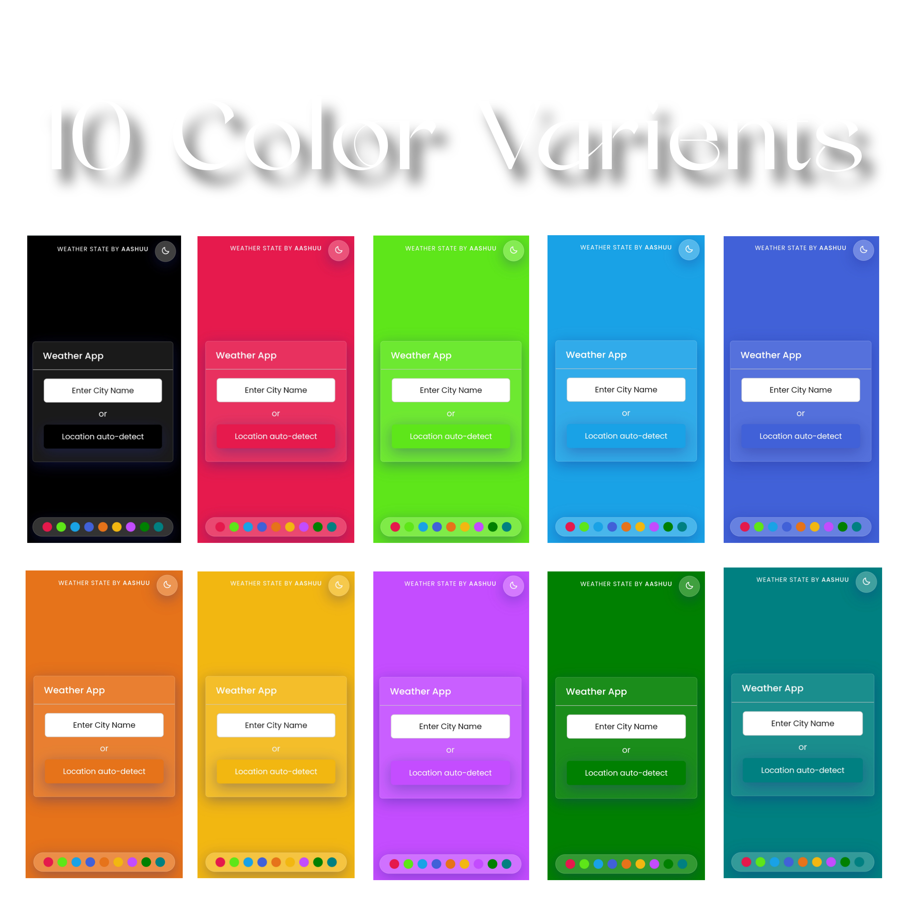

  
  
  
 

  
  
  <h2 align="center">Weather State</h2>

 `Weather Web App to get the current weather state using the openweathermap API 🌐`

  <a href="https://weatherstate.vercel.app/"><strong>➥ Live Demo</strong></a>

 

 

`Don't forget to starred this repository ⭐`

